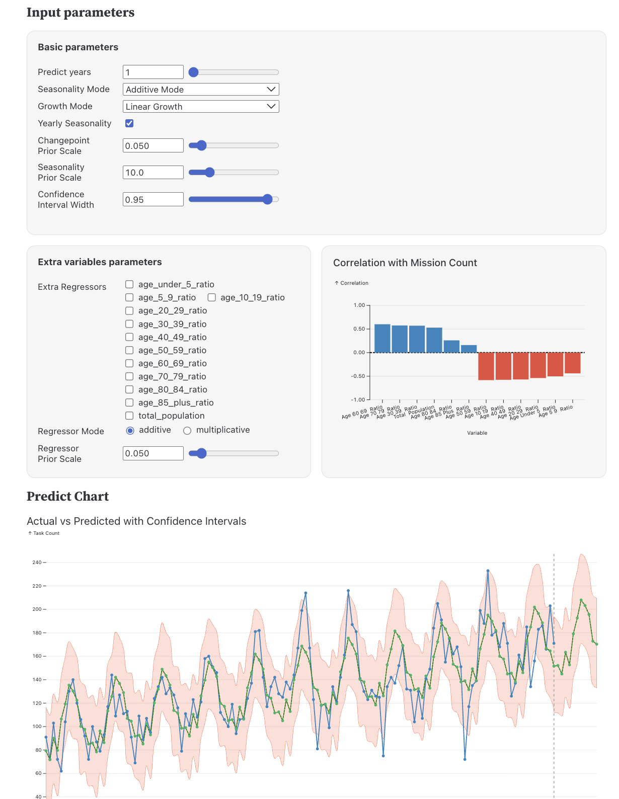
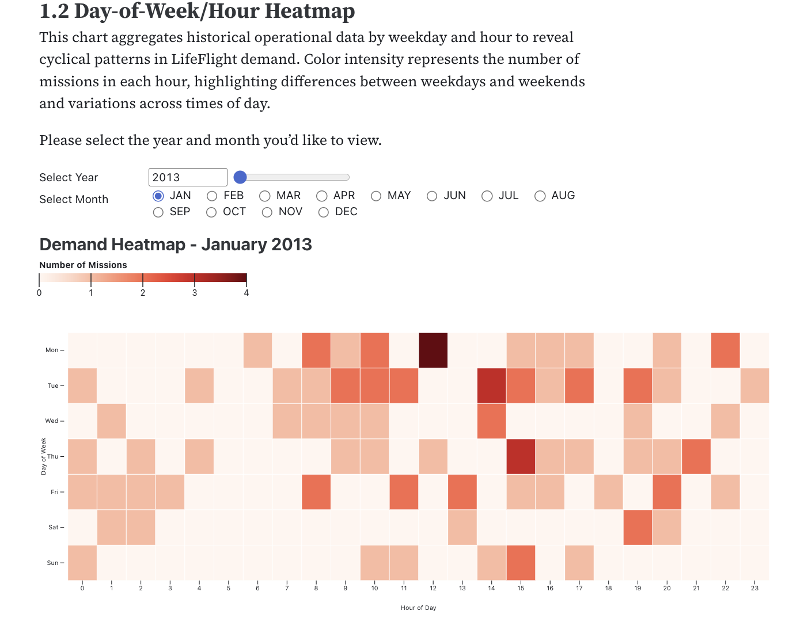
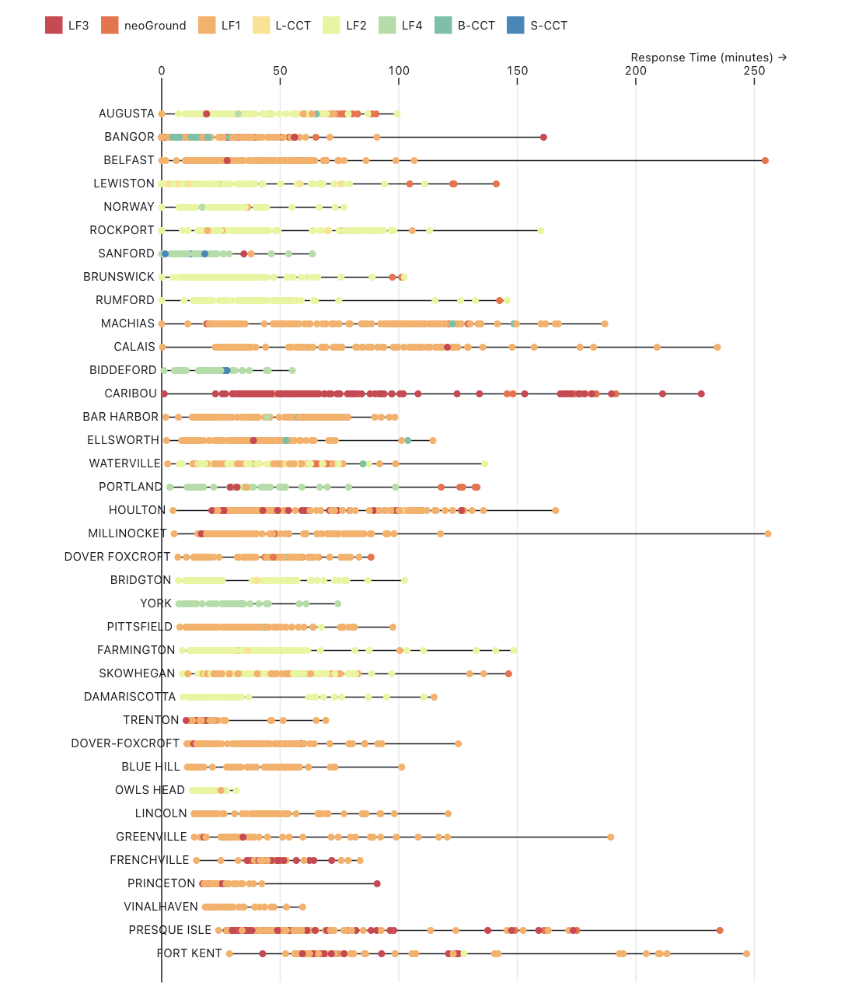
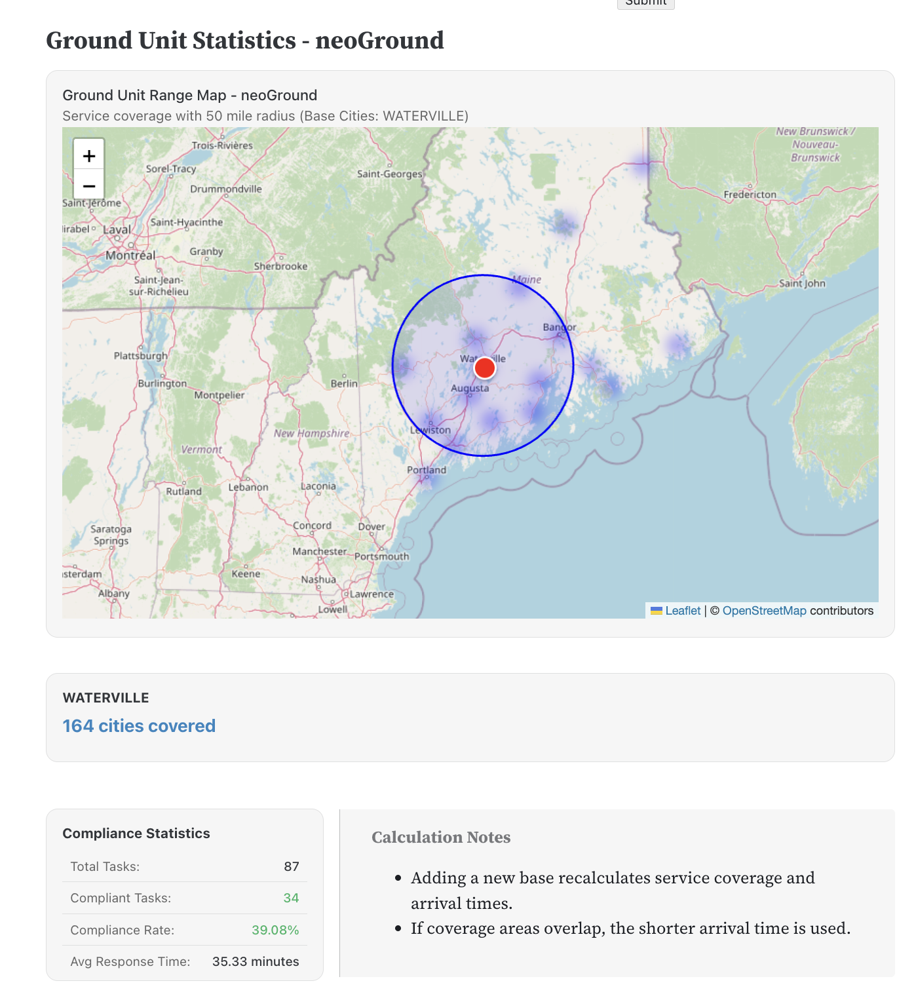

# Lifeflight Dashboard

LifeFlight of Maine is a non-profit air ambulance and critical care transport agency. It operates three modes of transport: helicopters, fixed-wing aircraft, and ground ambulances, including the specialized neoGround neonatal unit. At the same time, Maine is large, people are dispersed, weather is harsh, hospitals are closing or merging, and the population is aging. But LifeFlight's fleet and bases are finite. Under these constraints, planning base locations, dispatching aircraft and vehicles, and deciding whether to add or relocate bases become critical strategic questions.

We build an interactive data visualization dashboard for analyzing medical transport services data.


# Current Features

- Current Operations and Service Quality Analysis – how well is LifeFlight doing now?
    Use the Dashboard tab to explore recent mission volumes, dispatch times, and delay reasons. 

- Mid- to Long-Term Demand Forecasting – how many missions will there be in the future?
    Switch to Demand Forecasting to adjust model parameters and view 5–10 year mission projections.

- Scenario Simulation of Base Layout and Service Scope – under limited resources, how can bases and assets be arranged more effectively?
    Open the Base Layout & Coverage section to test different base configurations and compare coverage and response time under multiple scenarios.


# Tech Stack

### Backend:
- Python with Flask framework (see Backend/requirements.txt)
- Requires Python 3.9 or higher (developed with Python 3.12)

### Frontend:
- Observable Framework
- Requires Node.js 18 or higher (developed with Node.js 23)

### Start the backend
```
cd Backend
python3 -m venv venv
source venv/bin/activate
pip install -r requirements.txt
python app.py
```
The backend API will be available at: `http://localhost:5001/`

### Start the Framework app

```
cd lifeflight frontend
npm run dev
```
The frontend will be available at: `http://127.0.0.1:3000/ `

# Screenshots


### 1. Dashboard


This view shows mission volume by weekday and hour, together with dispatch times.  
It helps identify peak demand periods and time windows with slower dispatch performance.


This view compares workload across bases and visualizes “appropriate asset without delay” rates and delay reasons,  
highlighting overloaded bases and the main operational bottlenecks.

---

### 2. Demand Forecasting



This page uses a Prophet time-series model with demographic regressors to forecast mission volume over the next few years.  
It also reports MAE / MAPE / RMSE to evaluate model performance.



This heatmap aggregates historical missions by weekday and hour to reveal long-term cyclical patterns in LifeFlight demand.

---

### 3. Base Layout & Service Coverage Simulation

<!-- 

This view analyzes the mileage distributions for each air base, clarifying which bases mainly serve long-haul missions and which provide broader regional coverage. -->



This plot shows city-level response times by base, highlighting locations with significantly longer times that may indicate base locations that are too far away.


The interactive coverage map lets users toggle existing and candidate base locations and adjust the service radius  
to see how many high-demand areas would be covered under each scenario.



This ground-unit–specific view estimates typical speeds, coverage radius, and compliance rates for units such as neoGround,  
supporting data-driven base selection for ground transport.


# Data Sources

- **Maine Population Projections**:：https://www.maine.gov/dafs/economist/demographic-projections
- **Historical Population Data**：https://www.census.gov/data/developers/data-sets/acs-1year.html
- **Total Population for Maine Counties (2010-2019)**: https://www.census.gov/data/tables/time-series/demo/popest/2010s-counties-total.html
- **Maine Weather History**: https://www.wunderground.com/history/daily/US/ME/4210/date/2024-9-20

